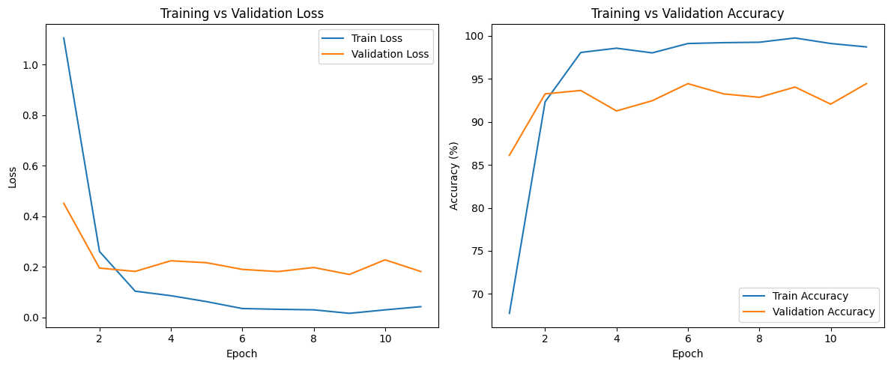
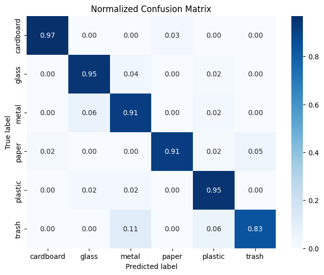
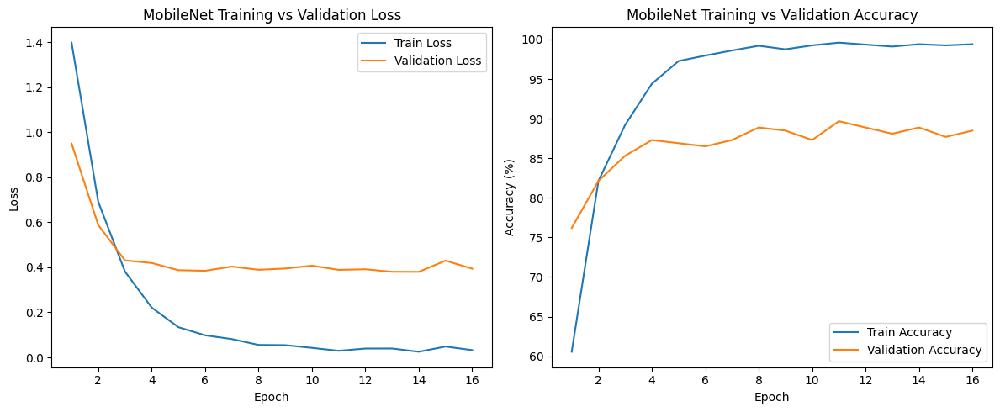
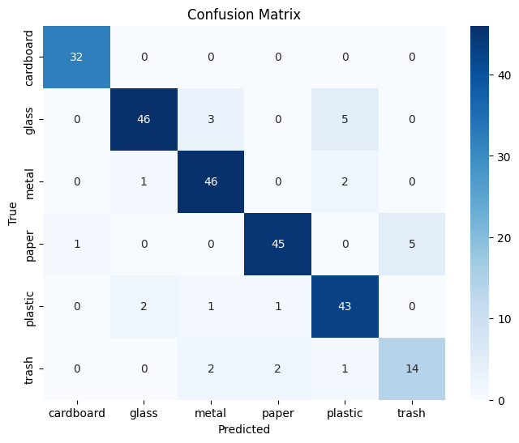
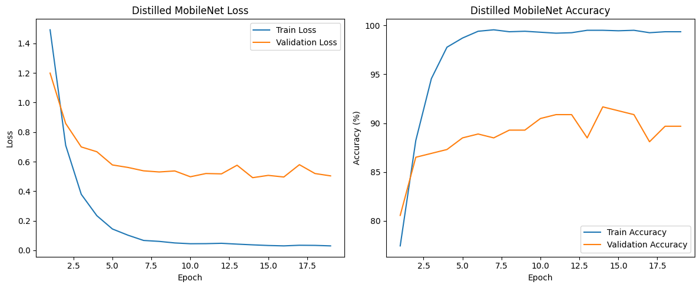
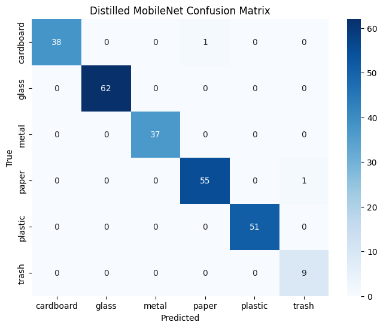

# Modeling
## 23 November 2025
  - Model A (ResNet50)
    - Last output log of training:
    ```
    Epoch 9/50, Loss: 0.016755091084633023, Accuracy: 99.75259772389906%, Validation Loss: 0.17050109419506043, Validation Accuracy: 94.04761904761905%
    Epoch 10/50, Loss: 0.03043110751968925, Accuracy: 99.10935180603661%, Validation Loss: 0.22845074511133134, Validation Accuracy: 92.06349206349206%
    Epoch 11/50, Loss: 0.04311724751096335, Accuracy: 98.71350816427511%, Validation Loss: 0.18214774038642645, Validation Accuracy: 94.44444444444444%
    Early stopping at epoch 11
    ```
    - File location for the weights: model/weights/model_A_0.0.1.pth

    - Training Metric:




  - Model B (MobileNet)
    - Last output log of training:
    ```
    Epoch 14/50 - Train Loss: 0.0249, Train Acc: 99.41% | Val Loss: 0.3800, Val Acc: 88.89%
    Epoch 15/50 - Train Loss: 0.0481, Train Acc: 99.26% | Val Loss: 0.4296, Val Acc: 87.70%
    Epoch 16/50 - Train Loss: 0.0321, Train Acc: 99.41% | Val Loss: 0.3940, Val Acc: 88.49%
    Early stopping at epoch 16
    ```

    - File location for the weights: model/weights/model_B_0.0.1.pth

    - Training metric:




  - Model C (MobileNet)
    - Last output log:
      ```
      Epoch 17: Train Loss=0.0345, Train Acc=99.26% | Val Loss=0.5796, Val Acc=88.10%
      Epoch 18: Train Loss=0.0336, Train Acc=99.36% | Val Loss=0.5198, Val Acc=89.68%
      Epoch 19: Train Loss=0.0303, Train Acc=99.36% | Val Loss=0.5039, Val Acc=89.68%
      Early stopping at epoch 19
      ```
    - Weight location: [dir](../model/weights/model_C_0.0.1.pth)

    - Training metric:




